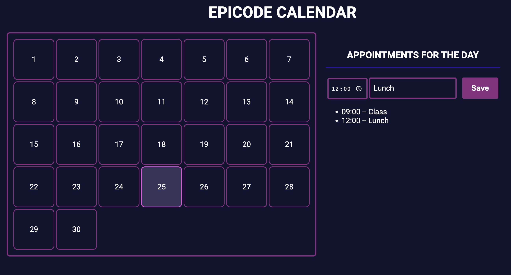

# Epicode Calendar

## 1) Analysis/Requirements Phase

Let's try to express the main features that we want to implement, in the form or User Stories.

### Features in scope

Features that we decided to include in this release, in this first version of the software.

- As a user, I want to see the days of the current month, so that I can plan my appointments
- As a user, I want to save appointments for a specific day and time, so that I can add them to my calendar
- As a user, I want to see all the appointments I save for a specific day, so that I can plan my day accordingly

### Features out of scope (nice to have)

Features that we decided to NOT include in this first version. Still, they could be included in the future.

- As a user, I want to add reminders for a specifc date & time, so that I can get the corresponding notifications
- As a user, I want to invite other people via email to my appointments, so that we can plan together

---

It is important to define what's in scope and what is not, to avoid scope creep: https://en.wikipedia.org/wiki/Scope_creep

## 2) UX / UI Design phase

Let's suppose this was done, based on the requirements.

This is the mockup of what we need to build

## 3) Software design phase

- We chose to use pure HTML + CSS + JS.

### Technical assumptions

- In this first version, we are building only the fron-end, and not saving the data. On page reload, we will lose data.
- We're not gonna show the number of days of the current month, at the moment: we're gonna show always thirty days. Dates are complex, let's not yet deal with them.

### Main HTML elements

- 30 div/button tags for the days, clickable. These will be created dynamically on page load using JS.
- Inputs for the appointment data: time, text (for the title)
- A save button, to save an appointment
- Two main div containers: calendar on the left, appointments on the right

### CSS main classes

- A class that gives a style to the days, when they are unselected.
- These is a class that styles the selected day. We remove it and add it to the new selected day when we click on another day.
- Styles for the calendar, the two areas of the app (left/right), the inputs.

### Main JS functions/events

- Onclick on a day: this will select the day (CSS class is added and also removed from the previously selecte day). Also, it will show the appointments for the day.
- Onclick on the save button: this will take the value of the text & time inputs, and save an appointment for the day. We need a variable or variables to SAVE appointments for each day - a MEMORY for our calender app.
- Onclick on the time: it will show selector for hours and minutes. This is actually already part of the input type="time". Same for the input type="text".
- To be faster in writing our code: when the page loads, we display 30 tags for the days using a for loop, so that we don't have to write 30 tags equals to each other manually.
